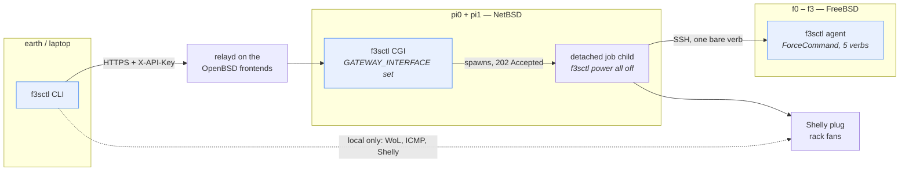
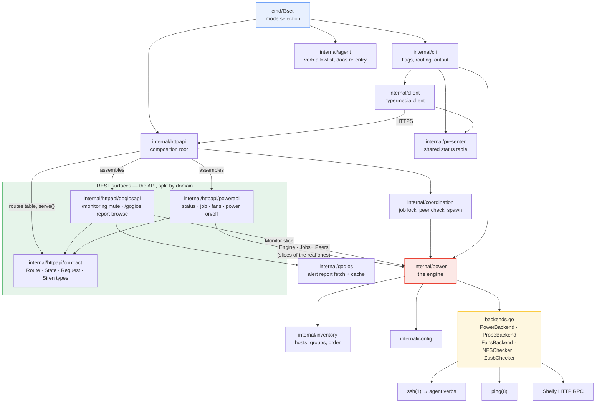
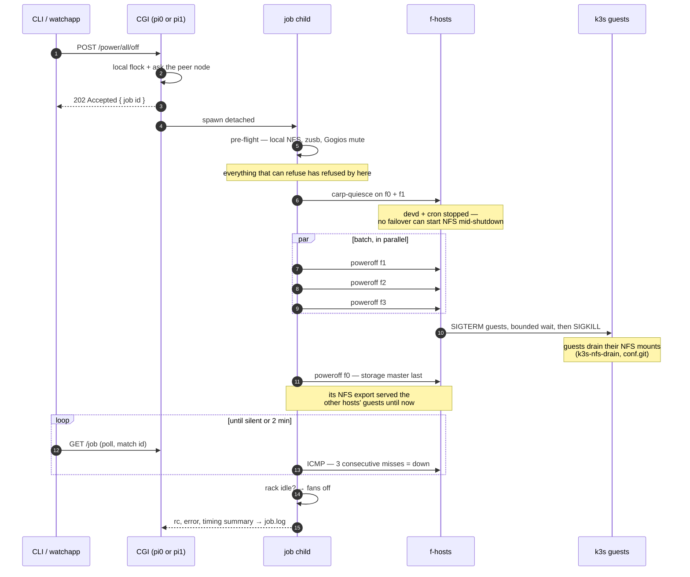
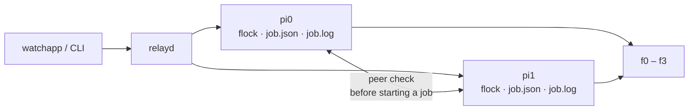
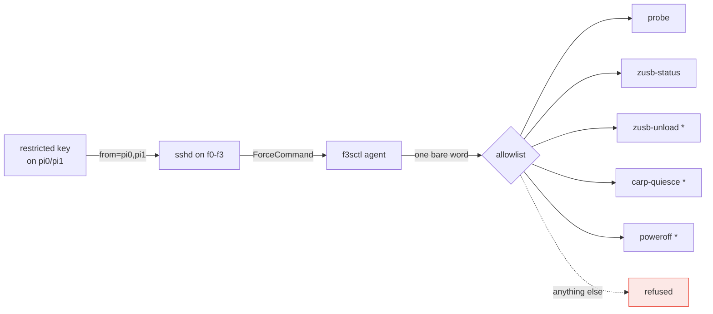

# f3sctl architecture

One binary, three modes, one engine. This document is the map; the reasoning
for any individual decision lives in the doc comment of the code that makes it,
which is where it can be kept honest.

- Writing a client: [`CLIENT.md`](CLIENT.md) (normative) and
  [`client-reference.js`](client-reference.js).
- What `power off` does, step by step: the README's "What `power off` actually
  does".

---

## 1. One binary, three modes



| Mode | Selected by | Runs on | Does |
|---|---|---|---|
| CLI | default | earth, pi0, pi1 | Everything, routing shutdowns through the API |
| CGI | `GATEWAY_INTERFACE` is set | pi0, pi1 (bozohttpd) | Serves the Siren API; spawns jobs |
| agent | `f3sctl agent` | f0–f3 | Five allowlisted verbs, nothing else |

**Shutdowns always go through the API**, from anywhere — only pi0/pi1 hold the
restricted SSH key, so routing through the API is what makes the same command
work from a laptop. Waking, status and the fan plug stay local: a magic packet
is an unprivileged broadcast any LAN host may send, which also leaves a way to
wake the rack when the API itself is down.

The OpenBSD gateways deliberately run **no** f3sctl: they only ever needed to
set and clear the Gogios mute marker, which a standalone script does behind the
same forced-command arrangement.

---

## 2. Packages



Two shapes are worth noticing.

**`internal/power` is the single implementation of what "power off" means.**
Both the CLI and the API drive it, so the two cannot disagree — the API
literally runs `f3sctl power all off` as a detached child.

**`internal/presenter` is shared by the local and remote paths** so the status
table cannot drift between `--local` and `--remote`.

**The REST surface is split the same way the API's concerns are.**
`internal/httpapi` is only the composition root: CGI parsing, auth, Siren
rendering, the route table assembly and the two root resources. Everything a
client actually talks about lives in a per-domain surface package next to it,
each declaring its routes next to the handlers that serve them:
`internal/httpapi/powerapi` (status, job, fans, power on/off and the `/power`
section folder) and `internal/httpapi/gogiosapi` (the mute concern and the
alert-report browse, gathered behind the `/gogios` section folder). The
folders are the wire half of that split: the root is a folder index carrying
no actions, each surface offers its operations in one browsable place, and
both are rendered from the same section-stamped route table that tags the
OpenAPI document. The shared vocabulary both speak — `contract.Route`,
`State`, `Request`, the Siren entity types — lives in
`internal/httpapi/contract`, which depends on neither side. The surfaces
reach the engine only through narrow interfaces (`Engine`, `Jobs`, `Peers`,
`Monitor`), so a surface can be declared, tested and served without a real
engine behind it — the same seam discipline `backends.go` gives the engine
itself.

Everything the engine does to the outside world goes through the interfaces in
`backends.go`. That is what lets the whole shutdown sequence — ordering,
refusals, the fan guard — be tested against fakes, with no SSH key, no Shelly
plug and no packets on the wire.

---

## 3. A shutdown, end to end



Two orderings carry the whole safety argument, and they are independent:

- **CARP is quiesced first.** A host that receives the storage VIP while
  shutting down runs `carpcontrol.sh`, which starts NFS on a machine seconds
  from powering off — that is what stranded f1 on 2026-08-08, powered on, off
  the network and not wakeable by Wake-on-LAN. Stopping `devd` and `cron` on
  the pair removes the hazard, which is what makes the batch safe to run in
  parallel. Both daemons come back by themselves at the next boot.
- **The storage master still goes last**, for a reason that has nothing to do
  with CARP: the other hosts' k3s guests mount their PVs from the VIP over NFS
  and are still writing while they stop. `PowerOff` returns only once a host's
  guests have stopped, which makes "the batch has finished" exactly the
  condition f0 waits for.

If the quiesce fails on either member, the run falls back to the old
one-at-a-time order rather than risking the wedge.

---

## 4. Two nodes, one rack



relayd load-balances the two Pis, and this is the single most common source of
client confusion:

- **Host and fan state are authoritative from either node** — both probe the
  same network.
- **Job state is local to the node that ran the job.** A `POST` may land on pi0
  and the follow-up `GET /job` on pi1, which holds a *different* job, quite
  possibly an old failed one. Every response carries `X-F3sctl-Node`, and job
  entities carry an `id`: **match it, or you will report healthy shutdowns as
  failures.**

The job lock is a local flock, which serialises only what reaches one node — so
before starting, each node asks its peer whether it is mid-job. That is not a
distributed lock and cannot be (the only shared storage is NFS from the cluster
being switched off), but it turns the race window from seconds into one HTTP
round trip.

---

## 5. Security boundary

The API host reaches the f-hosts with a key that can do exactly one thing:



`*` needs root, and re-enters the binary through `doas` with an exact-argv
rule per verb — never a general grant. The account is unprivileged, its
`authorized_keys` lives in a root-owned path outside its home so it cannot
re-authorise itself, and `ForceCommand` in `sshd_config` overrides whatever the
key file says. A request must be exactly one word from the list: no arguments,
nothing interpolated, nothing reaching a shell.

On pi0/pi1 the CGI needs **no** privilege escalation at all — Wake-on-LAN is an
unprivileged broadcast, ICMP comes from the setuid `ping`, and the SSH calls
use an explicit identity.

---

## 6. Where time goes

Every run ends with a timing summary in the job log, because "why did that take
so long" was otherwise unanswerable — the log said what happened, never how
long any of it took. A real `all-off`, v0.5.1:

```
Timing (total 3m11s):
  pre-flight checks         4s
  shutdown f3               7s
  shutdown f2              47s
  shutdown f1              47s
  shutdown batch           47s
  shutdown f0              48s
  confirm power-down      1m4s   <- longest
  rack fans                26s
```

That summary is what identified the real bottleneck when the rack still took
ten minutes: not the tool, but two k3s guests burning the full 240 s
`vm_shutdown_timeout` and being SIGKILLed, because their NFS transport
(stunnel) was stopped one second into the guest's shutdown while sixty
containers were still writing to `hard` NFS mounts. The fix is guest-side
(`k3s-nfs-drain` in `conf.git`); the host-side parallelism above was worth
little until it landed.
